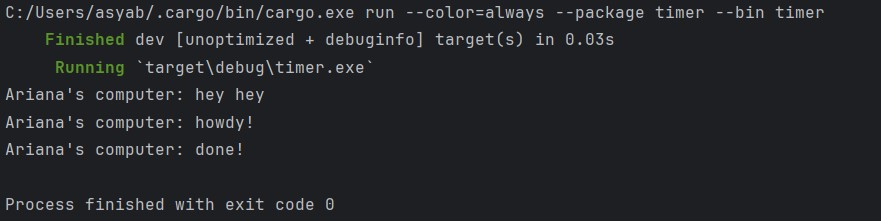
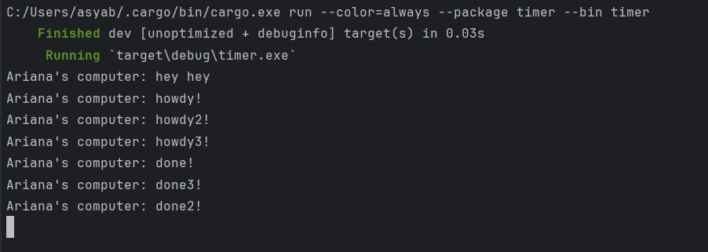

## 1.2. Understanding how it works
- Text `Ariana's computer: hey hey` dicetak terlebih dahulu karena `println!("Ariana's computer: hey hey");
  ` berada di luar fungsi async. Hal ini menyebabkan text tersebut dieksekusi tanpa menunggu selesainya eksekusi fungsi async. Dengan demikian, text `Ariana's computer: hey hey` dicetak terlebih dahulu sebab fungsi async perlu menunggu hasil dari future. Output yang dihasilkan program adalah sebagai berikut.

## 1.3. Multiple Spawn and removing drop
- Pada eksperimen ini, dilakukan penghapusan statement `drop(spawner)` dan melakukan replikasi `spawner.spawn` menjadi tiga kali. Dengan demikian, terdapat 3 program yang dieksekusi bersamaan secara async dari urutan tercetaknya. Pemanggilan spawn sebanyak 3 kalu menyebabkan spawner memasukkan 3 task ke dalam antrean task sender. Kemudian, executor mengambil task dari antrean task sender tersebut satu per satu lalu mengeksekusinya, begitu seterusnya hingga task dalam antrean tak lagi tersisa. Program berjalan secara async sehingga executor akan mengambil task selanjutnya untuk mulai dieksekusi walaupun task sebelumnya belum selesai dieksekusi. Statement `drop(spawner)` menandakan interaksi sudah selesai dan spawner akan ditutup. Penghapusan line drop spawner menyebabkan program menganggap bahwa masih akan ada pengiriman data oleh spawner sehingga program tidak akan berakhir. 
  - Saat pemanggilan fungsi spawn oleh spawner, maka task baru akan dimasukkan ke dalam antrean task sender. 
  - Executor akan mengambil dan mengeksekusi satu per satu task dari antrean tersebut hingga tak ada lagi task yang tersisa dalam antrean. 
  - Penggunaan statement drop(spawner) menjadi tanda selesainya interaksi dan spawner dapat ditutup.
